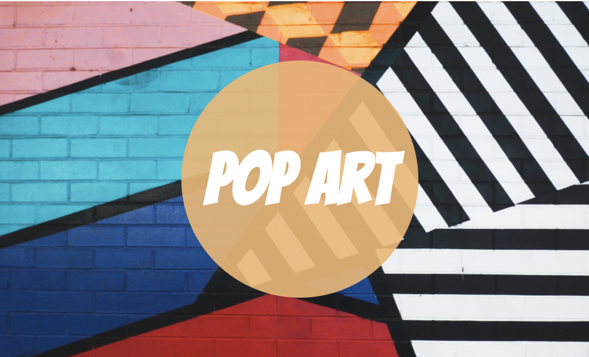
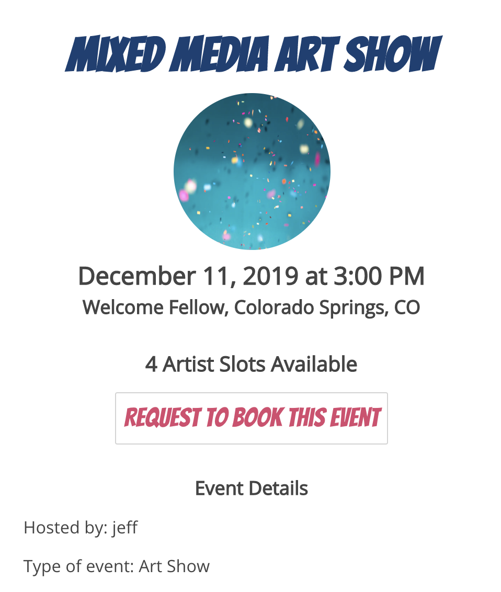
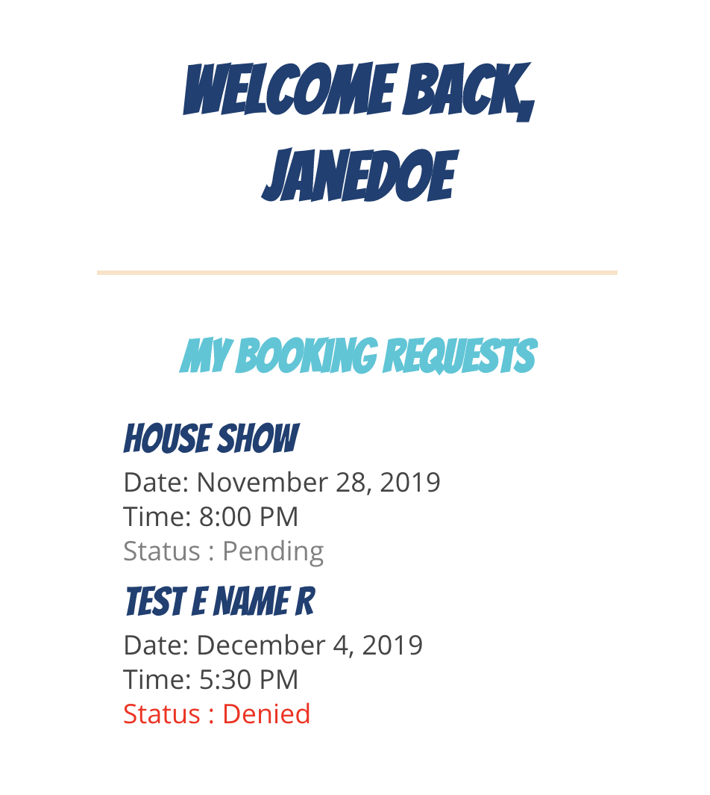
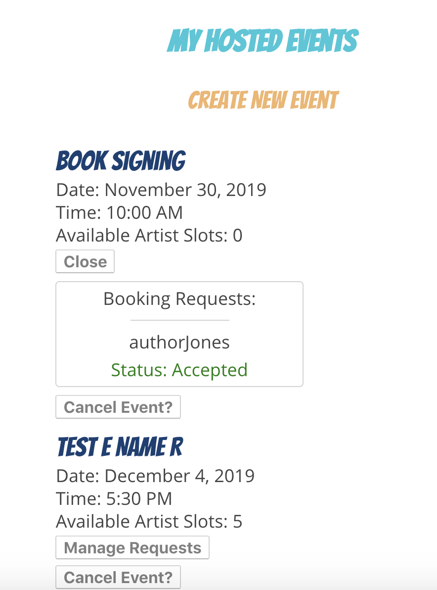

## Pop Art 

 
See It Live: https://pop-art.now.sh/
Created by Shannon Lichtenwalter

### What is Pop Art?
Pop are is an interactive application that was created to make booking talented artists for events easier and simplified. Event hosts are able to create event pages which serve a dual purpose of: 
1. Advertising the local event to the community
2. Making artists aware of opportunities for events that they could book. 

This application can be used by local bands, coffee shops, bars, artists, event hosts and creators of all types to help making booking easier for local artists. 

Without an account, a user can navigate to the website and browse upcoming events on the homepage. They can filter events by type, date, and location.

By creating an account, a user then has the ability to create events that they are hosting, or they can request to book events if they feel they would be a good fit for the event. 

By hosting an event, the user can specify how many artists they need for said event. The user will then receive requests from artists to book the event. The user can accept or deny the artist's request. 
 

### Tech Stack

This application was built using React, Javascript, Html, and CSS. It is intended to interact with the Pop Art Express Server that was built with Node, Express, and PostgreSQL.

### The API
The api stores data about users of Pop Art and the events the create and request to book. The api requires authorization to access most endpoints with the exception of 
getting a list of all upcoming events. 

